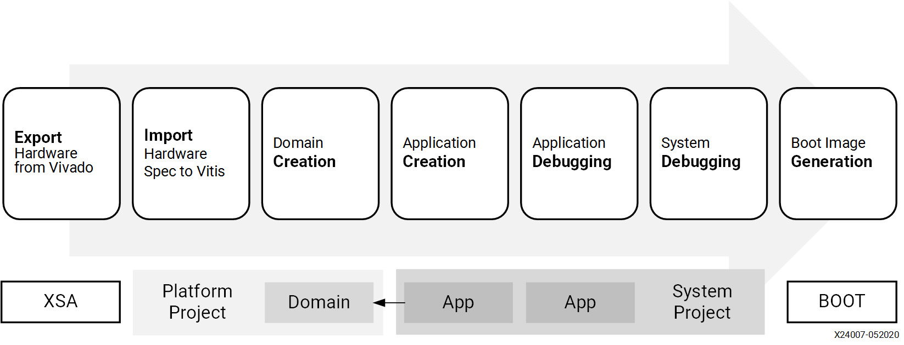
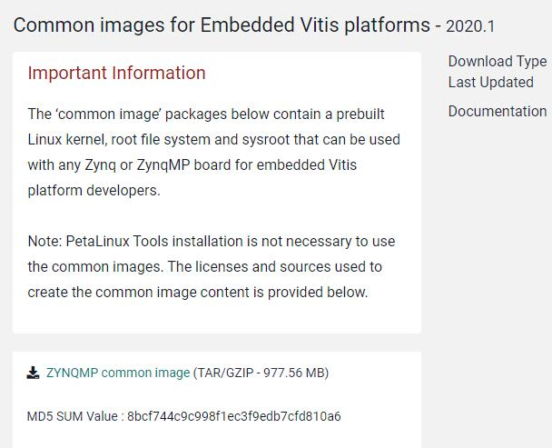
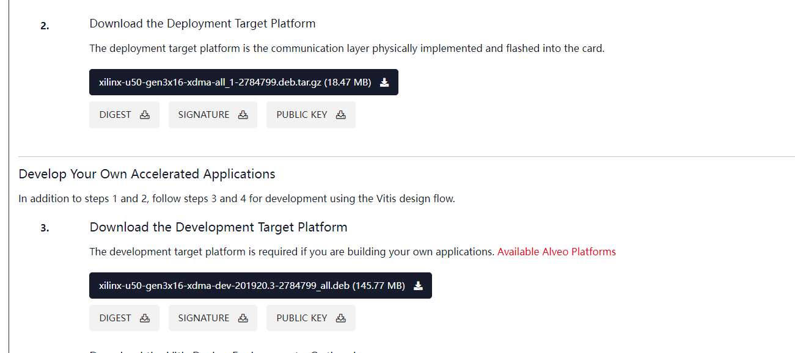

# Vitis_workflow
本教程主要介绍利用vitis工具流使用，如图所示是vitis工具流的概览。

FPGA：  ZCU104、Alevo U50

系统：  ubuntu18.04



## 1 教程目录

1. [overall](./overall/README.md)：整体加速器部署流程简介，并给出一个简单样例作为参考。

2. [multi-kernels](./multi-kernels/README.md)：加速器多核部署方案样例，涉及单核多部署，多核单部署以及多核多部署。

3. [host](./host/README.md)：vitis加速应用的上层控制代码编写。

4. [Makefile](./Makefile/README.md)：vitis工具流编译文件规则，一键式部署方案设计。


## 2 环境准备

### 2.1 安装所需依赖
```
sudo apt-get install ocl-icd-libopencl1 opencl-headers ocl-icd-opencl-dev
sudo add-apt-repository ppa:xorg-edgers/ppa 
sudo apt-get update
sudo apt-get install libgl1-mesa-glx
sudo apt-get install libgl1-mesa-dri
sudo apt-get install libgl1-mesa-dev
sudo add-apt-repository --remove ppa:xorg-edgers/ppa
sudo apt install net-tools
sudo apt-get install -y unzip
sudo apt install gcc
sudo apt install g++
sudo apt install python
ln -s /usr/bin/python2 /usr/bin/python
sudo apt install putty
curl -1sLf \
   'https://dl.cloudsmith.io/public/balena/etcher/setup.deb.sh' \
   | sudo -E bash
sudo apt-get update
sudo apt-get install balena-etcher-electron
```
### 2.2 下载安装vitis相关工具

1. [安装vitis软件](https://www.xilinx.com/support/download/index.html/content/xilinx/en/downloadNav/vitis.html)，这里下载的版本号最好要与之后下载相关内容保持一致。
	例如：这里下载了vitis2020.2，后续的软件和镜像最好也下载2020.2或者之前版本以保证兼容性。

2. [安装XRT软件](https://www.xilinx.com/products/design-tools/vitis/xrt.html#gettingstarted)，XRT是Xilinx FPGA的运行时库。

3. 配置环境
```
source /tools/Xilinx/Vitis/2020.2/settings64.sh
source /tools/Xilinx/Vitis_HLS/2020.2/settings64.sh
source /opt/xilinx/xrt/setup.sh
```

4. 平台描述文件下载

    +   ZCU104

        - [下载ZCU104平台描述文件](https://www.xilinx.com/support/download/index.html/content/xilinx/en/downloadNav/embedded-platforms.html)，解压ZCU104平台描述文件，并将其复制到 `/opt/xilinx/platforms/` 下。

	        ps：对于这里使用vitis 2020.2版本的同学来说，请选择2020.1版本的ZCU104平台描述文件。

	        pss：2020.2版本的平台描述文件没有包含opencl domain，无法使用xrt方式运行并对PL编程。

        - [下载ZYNP平台通用镜像并解压](xilinx.com/support/download/index.html/content/xilinx/en/downloadNav/embedded-platforms/archive-vitis-embedded.html)，选择ZYNQMP common image。

        

        - ZYNP平台通用镜像展开，经过这个步骤，获得后续进行工程的镜像和文件树等内容。
            ```
            cd xilinx-zynqmp-common-v2020.2/
            sudo gunzip ./rootfs.ext4.gz
            ./sdk.sh -y -dir ./ -p
            ```

    + Alveo U50

        - [下载U50平台描述文件](https://www.xilinx.com/products/boards-and-kits/alveo/u50.html#gettingStarted)并安装。

        - [下载U50物理层通信驱动](https://www.xilinx.com/products/boards-and-kits/alveo/u50.html#gettingStarted)并安装。

        