# Multi-kernels implementation

加速器多核部署方案样例，涉及单核多部署，多核单部署以及多核多部署。

+ 单核多部署：指的是片上部署一个单一IP核心，并进行host端调度使用
+ 多核单部署：指的是片上部署多个单一IP核心，并进行host端调度使用
+ 多核多部署：指的是片上部署多个多种IP核心，并在host端随运行时切换调度

## 1 kernel代码

源代码里给出了两种kernel代码示例

+ [逐元素向量加法VADD IP](./src/kernel/vadd.cpp)

+ [逐元素向量乘法VMUL IP](./src/kernel/vmul.cpp)

## 2 U50部署示例

### 2.1 单核多部署

单核多部署会生成一个xclbin文件，通过host代码来进行IP核注册。

示例工程所需源文件：

+ host: 
    - event_timer.cpp&hpp
    - host-01.cpp&hpp
    - vadd_host-01.hpp
    - xcl2.cpp&hpp

+ kernel:
    - vadd.cpp&hpp

主要与一般部署不同的地方有如下几点

+ 在binary_container的设置中将kernel数量改变，示例里是2。

    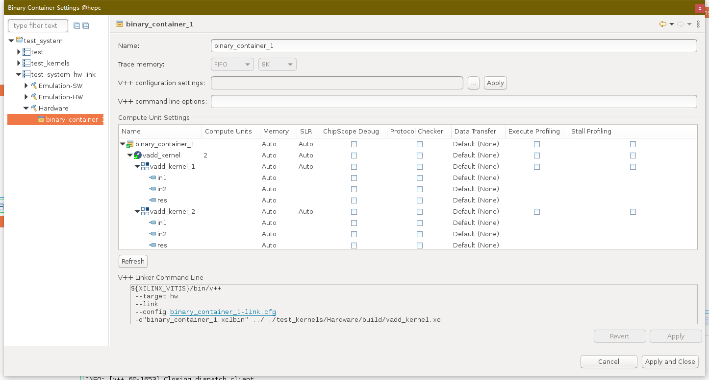

+ host端在进行使用多核时需要将所需要的核心进行注册。同理后续的内存空间映射和调度也需要类似处理。

    ps: 示例仅给出了两个核心并行同步处理的样例，如果有其他需求，则需要配合事件标志<cl::Event>进行复杂调度。

    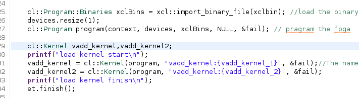

对应的结果展示

+ 片上布局

    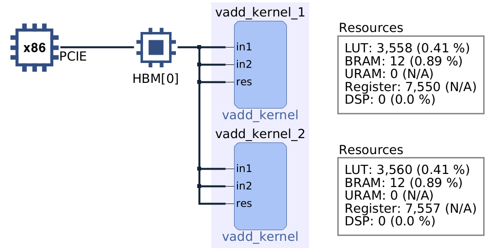

+ 运行代码
    ```
    ./test --xclbin ./binary_container_1.xclbin
    ```
    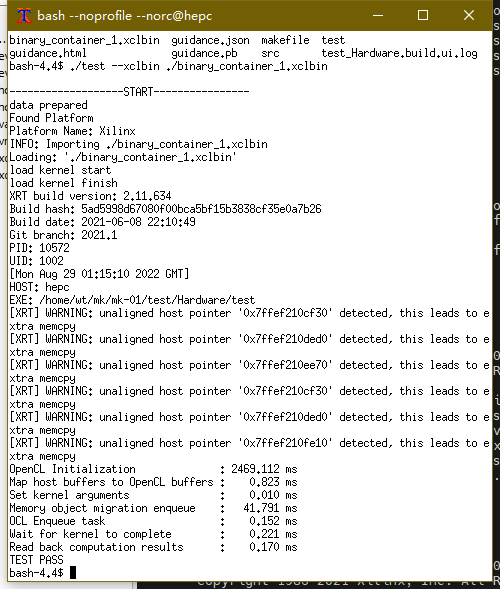

### 2.2 多核单部署

多核单部署会生成一个xclbin文件，通过host代码来进行IP核注册。

示例工程所需源文件：

+ host: 
    - event_timer.cpp&hpp
    - host-02.cpp&hpp
    - op_host-02.hpp
    - xcl2.cpp&hpp

+ kernel:
    - vadd.cpp&hpp
    - vmul.cpp&hpp

主要与一般部署不同的地方有如下几点

+ 在binary_container的设置中将多个kernel放在一块。

    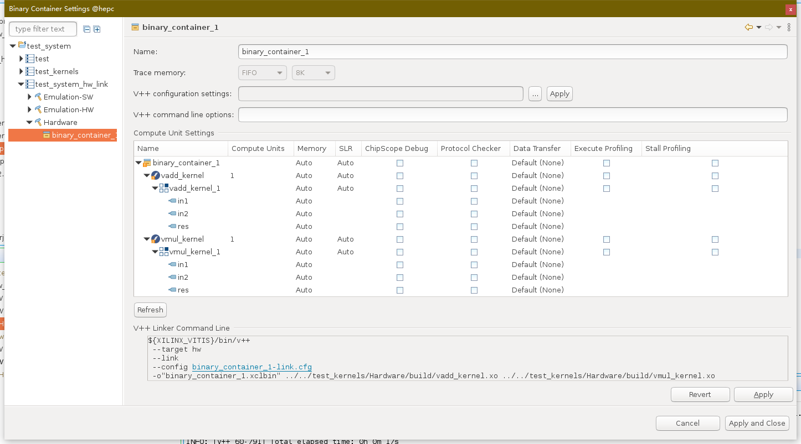

+ host端在进行使用多核时需要将所需要的核心进行注册。同理后续的内存空间映射和调度也需要类似处理。

    ps: 示例仅给出了两个核心并行同步处理的样例，如果有其他需求，则需要配合事件标志<cl::Event>进行复杂调度。

    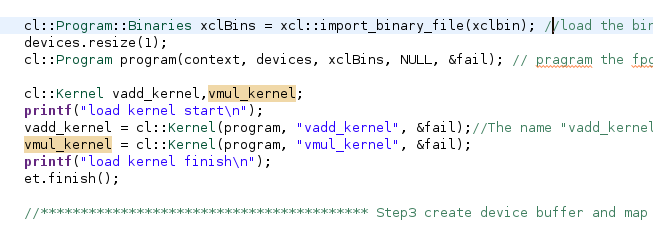

对应的结果展示

+ 片上布局

    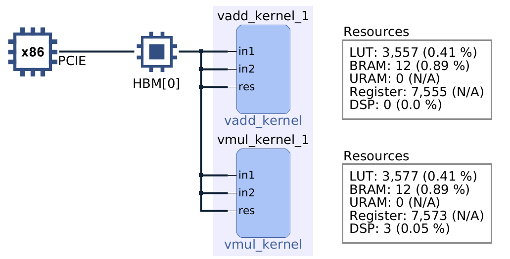

+ 运行代码
    ```
    ./test --xclbin ./binary_container_1.xclbin
    ```
    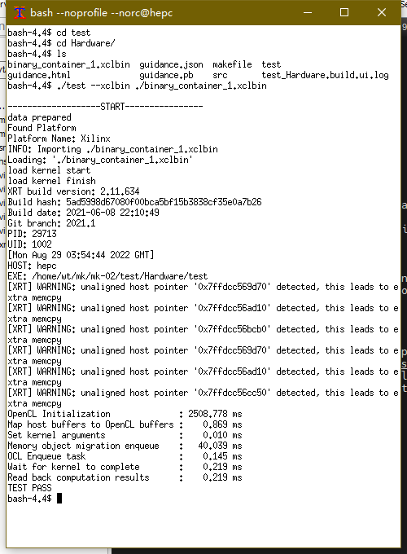


### 2.3 多核多部署

多核多部署会生成多个xclbin文件，通过host代码来进行计算时调度。

示例工程所需源文件：

+ host: 
    - event_timer.cpp&hpp
    - host-03.cpp&hpp
    - vadd_host-03.hpp
    - vmul_host-03.hpp
    - xcl2.cpp&hpp

+ kernel:
    - vadd.cpp&hpp
    - vmul.cpp&hpp

主要与一般部署不同的地方有如下几点

+ 多binary_container的设置，将不同的kernel放入同一工程下不同binary_container中以生成多个xclbin和对应驱动。
    
    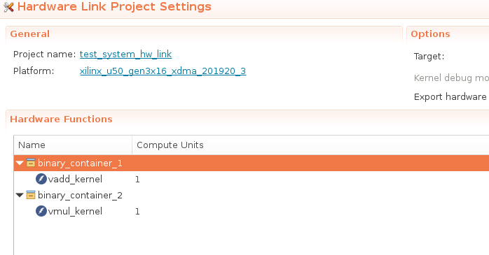

+ [为每个IP编写host](./src/kernel/host-03.cpp)

对应的结果展示

+ 片上布局

    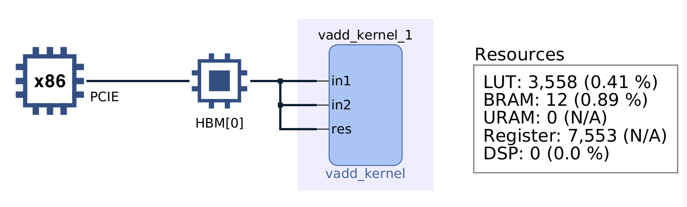
    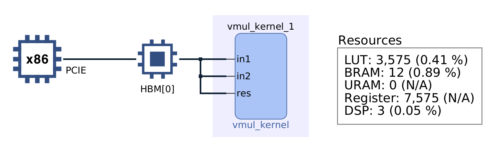
    
+ 下列代码运行的是VADD
    ```
        ./test --mode 0 
    ```
+ 下列代码运行的是VMUL
    ```
        ./test --mode 1 
    ```

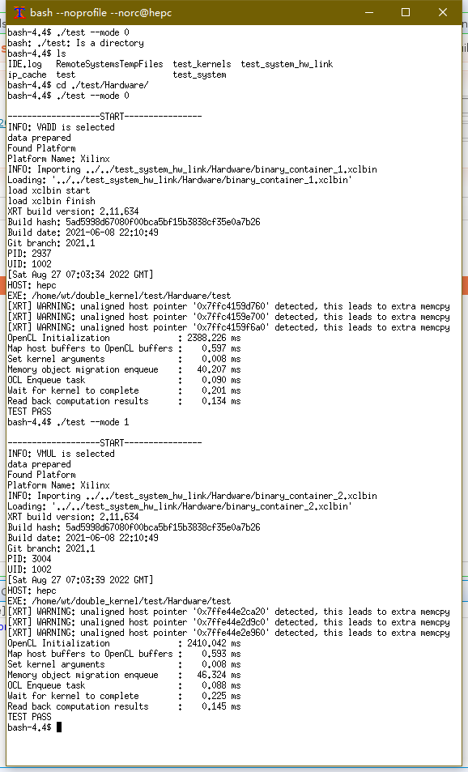
