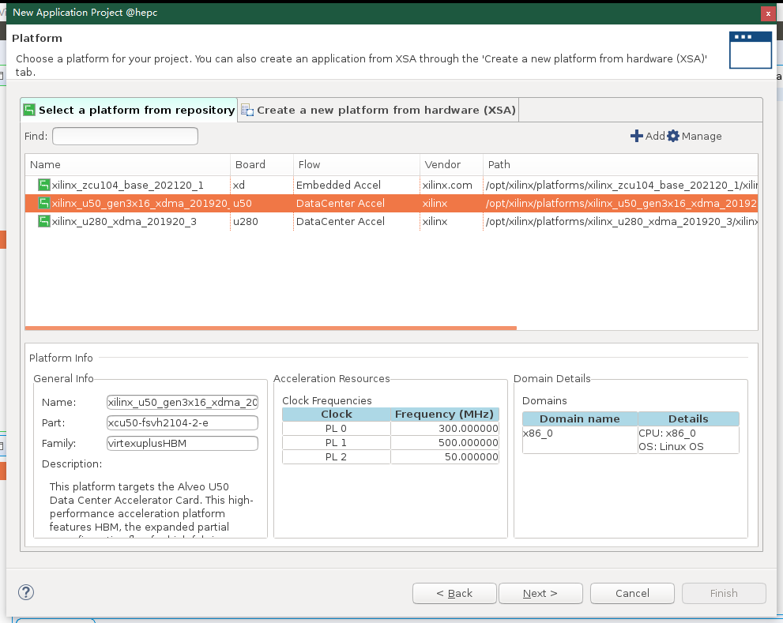
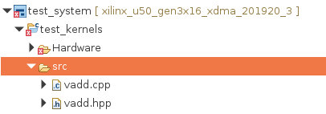
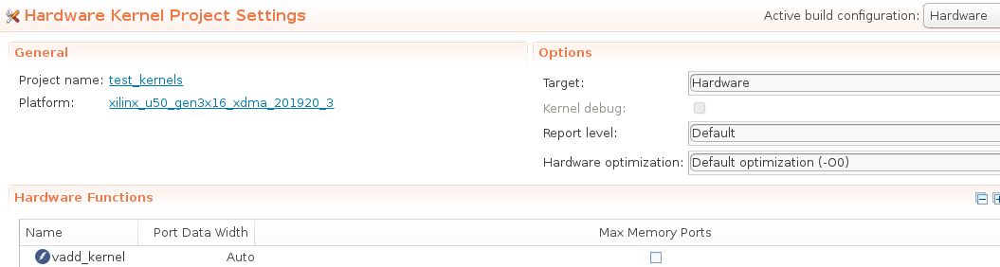
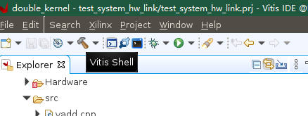
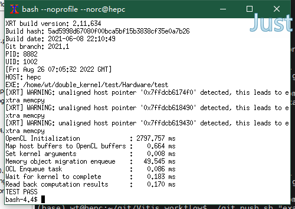

## 应用工程创建

### 建立工程
1. 在终端直接运行`vitis`，设置工作目录


2. 新建应用工程，并点击next


3. 选择之前已经安装好的U50平台描述文件



4. 输入应用名称，例如 test


5. 创建空白应用工程，选择Empty Application后点击Finish


### kernel端配置

1. 添加kernel代码，将编写好的kernel代码复制或导入到如图的src文件夹内



2. 打开上图中的test_kernels.prj配置kernel信息

3. 注册kernel函数，点击Add Hardware Fuction，添加硬件单元的TOP函数



4. 可选配置
	+ 设置kernel编译时频率约束
		- 在Assistant界面右键kernel项目部分
		- 单击Settings进入编译设置界面
		- 在kernel目录下的Hardware中选中$YOUR_KERNEL_NAME选项
		- 在v++ compiler options中添加`--hls.clock 300000000:$YOUR_KERNEL_NAME`，其中300000000代表300MHz

    

	+ 关联vitis_hls软件，工程编译以后可用
		- 打开之前的test_kernels.prj页面
		- 单击下图选中的图标快速打开hls软件调试kernel代码

    

### host端配置

1. 添加host代码，将编写好的host代码复制或导入到如图的src文件夹内


### HW-link配置

1. 打开图中的test_system_hw_link.prj配置link信息
2. 点击Add Binary Container创建一个容器
3. 点击ADD Hardware Fuction添加硬件单元的Top Fuction


4. 可选配置

	+ 设置硬件实现频率约束
		- 在Assistant界面右键hw_link项目部分
		- 单击Settings进入编译设置界面
		- 在hw_link目录下的Hardware中选中$YOUR_CONTAINER_NAME选项
		- 在v++ compiler options中添加`--kernel_frequency 300`，其中300代表300MHz

	+ 设置kernel端口映射
		- 在下图中的Memory选项中可以配置kernel的端口映射信息

    

	+ 关联vivado软件，工程编译以后可用
		- 在Assistant界面右键hw_link项目下的container部分
		- 单击Open Vivado Project进入vivado工程快速调试
		
    

## 应用工程编译

在Explorer界面选中System后，便可在菜单中点击build按钮，其中编译分为三种模式

+ Emulation-SW：软件仿真，类似于hls的纯软件仿真，主要是用于验证算法的正确性
+ Emulation-HW：硬件仿真，仿真真实的硬件连接，用于检查硬件链接问题以及内存访问问题
+ Hardware：硬件实现，编译可用于FPGA硬件的工程文件


## 硬件部署

1. 打开vitis命令行



2. 启动后运行如下命令
```
cd ./test/Hardware/
```

3. 执行host程序

```
./test --xclbin ./binary_container_1.xclbin
```

